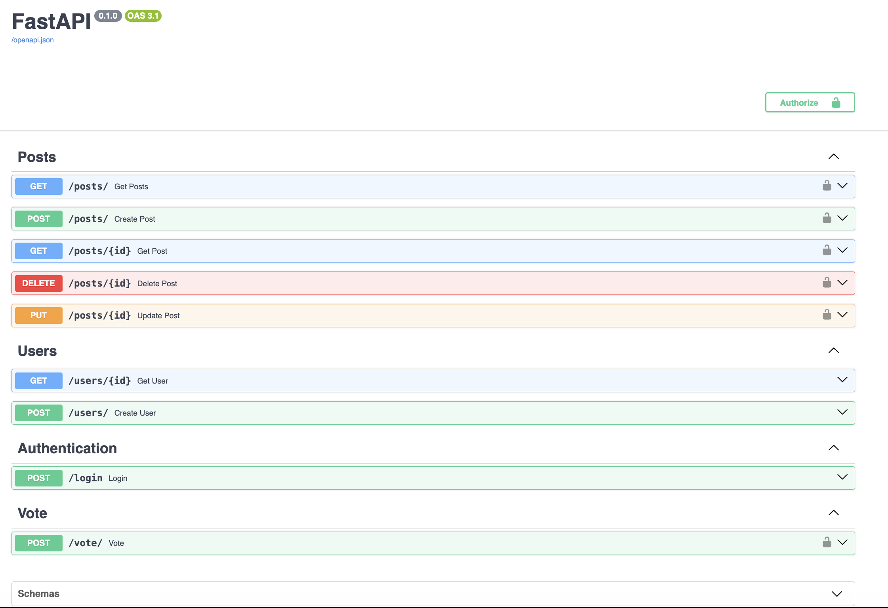

# FastAPI Service

[](https://github.com/osanto/fast-api-example/actions/workflows/build-deploy.yml)
[](https://fast-api-example-w11a.onrender.com/docs)
[](https://github.com/psf/black)
[](https://www.python.org/downloads/)
[](https://fastapi.tiangolo.com)
[](https://www.postgresql.org/)

Minimal backend service with validated endpoints and automated tests,used to demonstrate API-level testing and backend understanding.

## Why this project

This service exists to practice API design and testing at the boundary between client and backend, focusing on correctness and contract validation.

## 📑 Table of Contents

- [Features](#-features)
- [Technology Stack](#-technology-stack)
- [Project Structure](#-project-structure)
- [Installation & Setup](#️-installation--setup)
- [Testing](#-testing)
- [How to Use the API](#-how-to-use-the-api)
- [Database Migrations](#️-database-migrations)
- [Development](#-development)
- [CI/CD with GitHub Actions](#️-cicd-with-github-actions)
- [Deployment](#-deployment)
- [License](#-license)
- [Acknowledgments](#-acknowledgments)

## 🚀 Features

- **Modern Python API Framework** - Built with FastAPI for high performance and automatic API documentation
- **Database Integration** - PostgreSQL with SQLAlchemy ORM for data management
- **Database Migrations** - Alembic for version-controlled schema changes
- **Containerization** - Docker and Docker Compose
- **Testing** - Integration tests using pytest and FastAPI TestClient
- **CI/CD Pipeline** - GitHub Actions for automated testing and deployment
- **API Documentation** - Auto-generated interactive API docs (Swagger/OpenAPI)

## 📋 Technology Stack

### Core Framework

- **[FastAPI](https://fastapi.tiangolo.com/)** - Modern, fast Python web framework for building APIs
- **Python 3.x** - Primary programming language

### Database & ORM

- **[PostgreSQL](https://www.postgresql.org/)** - Relational database
- **[SQLAlchemy](https://www.sqlalchemy.org/)** - Python SQL toolkit and ORM
- **[Alembic](https://alembic.sqlalchemy.org/)** - Database migration tool

### Testing

- **[pytest](https://pytest.org/)** - Testing framework
- **[FastAPI TestClient](https://fastapi.tiangolo.com/tutorial/testing/)** - Built-in testing utilities

### DevOps

- **GitHub Actions** - CI/CD automation

## 📁 Project Structure

```
fast-api-example/
├── .github/
│   └── workflows/          # GitHub Actions CI/CD pipelines
├── alembic/                # Database migration scripts
│   └── versions/           # Migration version files
├── app/                    # Main application code
│   ├── routers/            # API route handlers
│   │   ├── auth.py         # Authentication routes
│   │   ├── post.py         # Post routes
│   │   ├── user.py         # User routes
│   │   └── vote.py         # Vote routes
│   ├── config.py           # Configuration management
│   ├── database.py         # Database configuration
│   ├── main.py             # FastAPI application entry point
│   ├── models.py           # SQLAlchemy models
│   ├── oauth2.py           # OAuth2/JWT authentication
│   ├── schemas.py          # Pydantic schemas
│   └── utils.py            # Utility functions
├── tests/
│   └── tests_integration/  # Integration tests
│       ├── conftest.py     # Pytest fixtures and configuration
│       ├── test_posts.py   # Posts API tests
│       ├── test_users.py   # Users API tests
│       └── test_votes.py   # Votes API tests
├── .env.docker.example     # Docker environment variables template
├── .env.local.example      # Local development environment template
├── alembic.ini             # Alembic configuration
├── docker-compose.yml      # Docker Compose configuration
├── Dockerfile              # Docker image definition
├── requirements.txt        # Production dependencies
└── requirements-dev.txt    # Development dependencies
```

## 🛠️ Installation & Setup

### Prerequisites

- Python 3.12+
- PostgreSQL 12+
- Docker & Docker Compose (optional, for containerized setup)

### Local Development Setup

1. **Clone the repository**

   ```bash
   git clone https://github.com/osanto/fast-api-example.git
   cd fast-api-example
   ```

2. **Create a virtual environment**

   ```bash
   python -m venv venv
   source venv/bin/activate  # On Windows: venv\Scripts\activate
   ```

3. **Install dependencies**

   ```bash
   pip install -r requirements.txt
   pip install -r requirements-dev.txt  # For development
   ```

4. **Set up environment variables**

   ```bash
   cp .env.local.example .env.local
   # Edit .env.local with your database credentials and configuration
   ```

5. **Run database migrations**

   ```bash
   alembic upgrade head
   ```

6. **Start the development server**

   ```bash
   uvicorn app.main:app --reload
   ```

7. **Access the application**
   - API: http://localhost:8000
   - Interactive API docs (Swagger): http://localhost:8000/docs
   - Alternative API docs (ReDoc): http://localhost:8000/redoc

### Docker Setup (Alternative)

1. **Set up environment variables for Docker**

   ```bash
   cp .env.docker.example .env.docker
   # Edit .env.docker with your configuration
   ```

2. **Start services with Docker Compose**

   ```bash
   docker-compose up -d
   ```

   This will start:

   - PostgreSQL database
   - FastAPI application with auto-reload
   - Automatic database migrations

3. **Access the application**

   - API: http://localhost:8000
   - Interactive API docs: http://localhost:8000/docs

4. **Stop services**

   ```bash
   docker-compose down
   ```

## 🧪 Testing

### Run All Tests

```bash
pytest
```

### Run Tests with Coverage

```bash
pytest --cov=app --cov-report=html
```

### Run Specific Test File

```bash
pytest tests/tests_integration/test_posts.py
```

## 📊 How to Use the API

This is a social media-style API where users can create posts, and other users can vote on them.

### Quick Start Guide

1. **Register a User** → Create an account
2. **Login** → Get authentication token
3. **Create Posts** → Share content
4. **Vote on Posts** → Like/upvote posts from other users
5. **View Posts** → See all posts with vote counts



### API Endpoints Reference

#### ❤️ Health Check

##### Check Application Health

```http
GET /
```

**Response:**

```json
{
  "status": "healthy",
  "message": "FastAPI is running"
}
```

Used by deployment platforms (like Render) to verify the application is running correctly.

---

#### 🔐 Authentication & Users

##### Register a New User

```http
POST /users
Content-Type: application/json

{
  "email": "user@example.com",
  "password": "securepassword123"
}
```

**Response:**

```json
{
  "id": 1,
  "email": "user@example.com",
  "created_at": "2024-01-01T12:00:00Z"
}
```

##### Login

```http
POST /auth/login
Content-Type: application/x-www-form-urlencoded

username=user@example.com&password=securepassword123
```

**Response:**

```json
{
  "access_token": "eyJhbGciOiJIUzI1NiIsInR5cCI6IkpXVCJ9...",
  "token_type": "bearer"
}
```

**Note:** Use this token in the `Authorization` header for authenticated requests:

```
Authorization: Bearer <your_access_token>
```

##### Get User Details

```http
GET /users/{id}
```

**Response:**

```json
{
  "id": 1,
  "email": "user@example.com",
  "created_at": "2024-01-01T12:00:00Z"
}
```

---

#### 📝 Posts

##### Get All Posts

```http
GET /posts
```

**Optional Query Parameters:**

- `limit` - Number of posts to return (default: 10)
- `skip` - Number of posts to skip (pagination)
- `search` - Search posts by title/content

**Example:**

```http
GET /posts?limit=5&skip=0&search=python
```

**Response:**

```json
[
  {
    "id": 1,
    "title": "My First Post",
    "content": "Hello World!",
    "published": true,
    "created_at": "2024-01-01T12:00:00Z",
    "owner_id": 1,
    "owner": {
      "id": 1,
      "email": "user@example.com"
    },
    "votes": 5
  }
]
```

##### Get a Specific Post

```http
GET /posts/{id}
```

**Response:**

```json
{
  "id": 1,
  "title": "My First Post",
  "content": "Hello World!",
  "published": true,
  "created_at": "2024-01-01T12:00:00Z",
  "owner_id": 1,
  "owner": {
    "id": 1,
    "email": "user@example.com"
  },
  "votes": 5
}
```

##### Create a New Post

```http
POST /posts
Authorization: Bearer <token>
Content-Type: application/json

{
  "title": "My Awesome Post",
  "content": "This is the content of my post",
  "published": true
}
```

**Response:**

```json
{
  "id": 2,
  "title": "My Awesome Post",
  "content": "This is the content of my post",
  "published": true,
  "created_at": "2024-01-01T13:00:00Z",
  "owner_id": 1
}
```

##### Update a Post

```http
PUT /posts/{id}
Authorization: Bearer <token>
Content-Type: application/json

{
  "title": "Updated Title",
  "content": "Updated content",
  "published": true
}
```

**Note:** You can only update your own posts.

##### Delete a Post

```http
DELETE /posts/{id}
Authorization: Bearer <token>
```

**Response:** `204 No Content`

**Note:** You can only delete your own posts.

---

#### 👍 Votes

##### Vote on a Post

```http
POST /votes
Authorization: Bearer <token>
Content-Type: application/json

{
  "post_id": 1,
  "dir": 1
}
```

**Parameters:**

- `post_id` - ID of the post to vote on
- `dir` - Vote direction: `1` for upvote, `0` for no vote

**Response:**

```json
{
  "message": "Successfully added vote"
}
```

**Note:** You cannot vote on your own posts.

##### Remove a Vote

```http
DELETE /votes
Authorization: Bearer <token>
Content-Type: application/json

{
  "post_id": 1
}
```

**Response:**

```json
{
  "message": "Successfully deleted vote"
}
```

---

### 📖 Interactive API Documentation

For a complete, interactive API documentation with the ability to test endpoints directly:

- **Swagger UI:** http://localhost:8000/docs
- **ReDoc:** http://localhost:8000/redoc

These provide:

- Full request/response schemas
- Try-it-out functionality
- Authentication testing
- Example requests and responses

---

## 🗄️ Database Migrations

### Create a New Migration

```bash
alembic revision --autogenerate -m "Description of changes"
```

### Apply Migrations

```bash
alembic upgrade head
```

### Rollback Migration

```bash
alembic downgrade -1
```

### View Migration History

```bash
alembic history
```

## 🔧 Development

### Code Quality Tools

The project uses the following tools (configured in `requirements-dev.txt`):

- **Black** - Code formatting
- **Flake8** - Linting

### Running Linters

```bash
# Format code
black app/ tests/

# Check linting
flake8 app/ tests/
```

## ⚙️ CI/CD with GitHub Actions

This project uses GitHub Actions for continuous integration and deployment. The workflow is defined in `.github/workflows/build-deploy.yml`.

### Workflow: Test and Deploy

**Triggers:**

- Push to any branch
- Pull requests to any branch

**Jobs:**

#### 1. **Build & Test Job**

Runs on every push and pull request:

- **Setup Environment**

  - Checkout code
  - Set up Python 3.12
  - Install dependencies

- **Database Setup**

  - Start PostgreSQL service container
  - Run database migrations with Alembic

- **Run Tests**

  - Execute pytest test suite
  - Generate test coverage reports
  - Ensure all integration tests pass

- **Code Quality Checks**
  - Run linting (Flake8)
  - Check code formatting (Black)

#### 2. **Deploy Job** (Production)

- **Deploy to [Render](https://render.com)**
  - Runs only on pushes to `main` branch after tests pass

### Required GitHub Secrets

| Secret Name          | Description                                     |
| -------------------- | ----------------------------------------------- |
| `RENDER_DEPLOY_HOOK` | Render deploy hook URL for automatic deployment |

---

## 🚀 Deployment

### Current Deployment

This project is deployed to **[Render](https://render.com)** - a modern cloud platform that automatically builds and deploys from GitHub.

**Deployment Platform:** Render.com  
**Deployment Method:** Automatic from GitHub  
**Deployment Trigger:** Automatic on push to `main` branch  
**Database:** Managed PostgreSQL on Render

### Deployment Steps

The automated deployment process on Render:

1. **Code Push** → Developer pushes to `main` branch
2. **GitHub Actions** → Runs tests and validates code
3. **Render Detection** → Render detects new commit
4. **Build** → Render installs Python dependencies from `requirements.txt`
5. **Database Migration** → Alembic runs migrations automatically
6. **Deploy** → New version is deployed with zero downtime
7. **Health Check** → Render verifies application is responding
8. **Live** → New version is live at production URL - https://fast-api-example-w11a.onrender.com/docs
9. **Rollback** → Previous version kept for instant rollback if needed

## 📄 License

This project is open source and available under the [MIT License](LICENSE).

## 🙏 Acknowledgments

- [FastAPI Documentation](https://fastapi.tiangolo.com/)
- [SQLAlchemy Documentation](https://docs.sqlalchemy.org/)
- [Alembic Documentation](https://alembic.sqlalchemy.org/)
